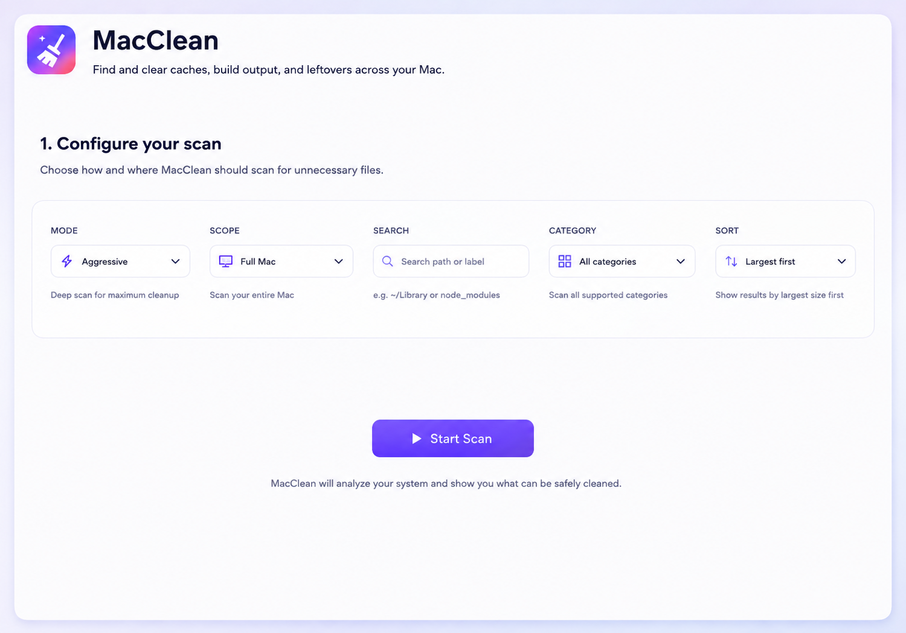
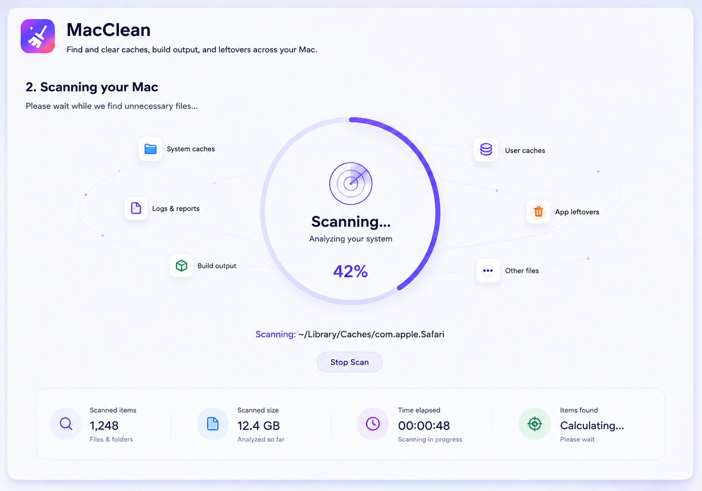
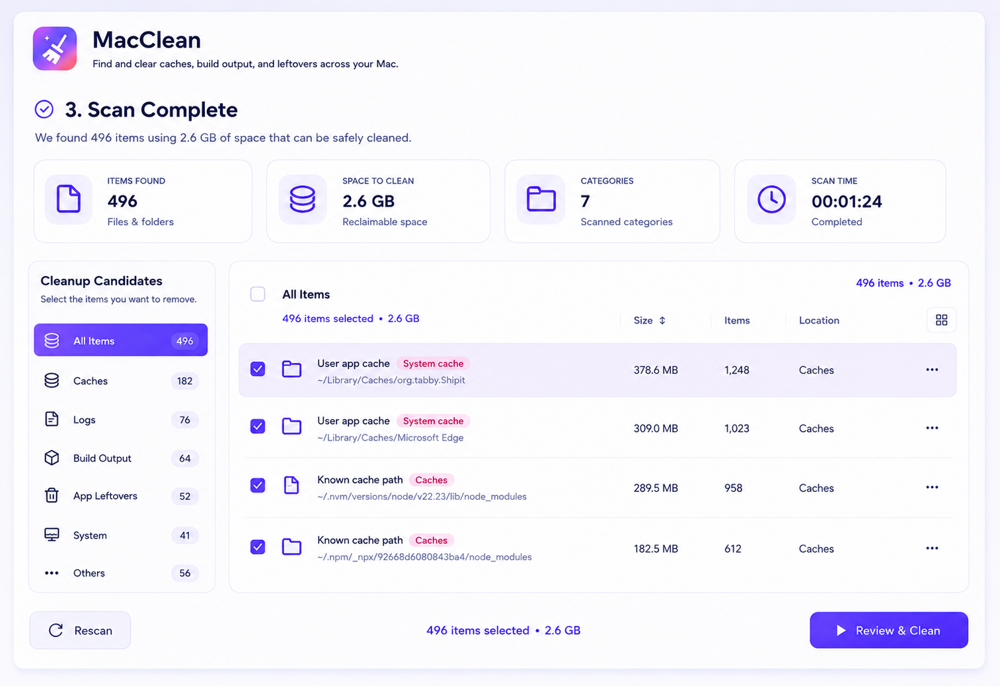
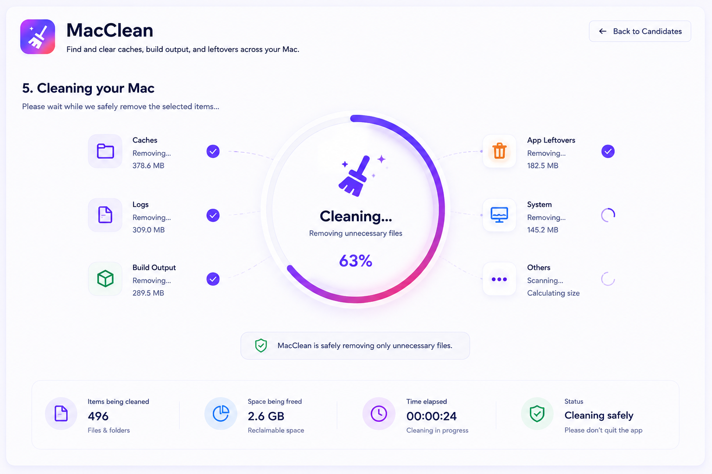

# MacClean

A native macOS utility that finds safe‑to‑remove **caches, build output and
developer leftovers** across your Mac, lets you review exactly what will go, and
deletes only what you choose.

Rewritten from the original Python web app into a self‑contained desktop
application:

**Svelte 5 · TypeScript · Vite · Tauri 2 · Rust · Tailwind CSS**

No Python. No local HTTP server. No browser window. One `MacClean.app`.

> The legacy Python implementation lives on the [`legacy-python`](https://github.com/bkrajendra/macclean/tree/legacy-python)
> branch, preserved unchanged.

---

## Screens

| Configure                            | Scanning                             | Results                              | Cleaning                             |
| ------------------------------------ | ------------------------------------ | ------------------------------------ | ------------------------------------ |
|  |  |  |  |

_(Design references — the shipped UI follows this layout with the real engine
data.)_

---

## Features

- **Two modes** — _Safe_ (caches + dependency folders) and _Aggressive_ (also
  build output, compiled artefacts, `*.pyc`).
- **Three scopes** — _Projects_ (`~/projects`), _User home_ (`~` + user caches),
  _Full Mac_ (all user homes + system cache locations). Plus extra folders via
  the UI or the `MACCLEAN_EXTRA_SCAN_ROOTS` environment variable.
- **21 recursive rules** (`node_modules`, `__pycache__`, `.next`, `target`,
  `.gradle`, `dist`, `.DS_Store`, …) + **14 user** + **6 system** exact cache
  rules — ported verbatim from the Python app. See _What MacClean cleans_ in the
  app, or [`docs/migration/feature-inventory.md`](docs/migration/feature-inventory.md).
- **Native, cancellable scanner** — parallel byte sizing, incremental streamed
  results, progress reporting, per‑error tolerance, never follows symlinked
  directories, de‑duplicates by canonical path.
- **Virtualised results** — search, category sidebar, sort, per‑row _Show in
  Finder_, select‑all / clear, running "selected · reclaimable" totals.
- **Defensive deletion** — permanent (not Trash), with a per‑item outcome
  breakdown: Deleted / Skipped / Failed / Permission denied / Already gone /
  Changed / Protected.
- **Permissions‑aware** — detects Full Disk Access, explains how to grant it,
  reports every location it could not read. Never runs as `root`.
- Light **and** dark, `prefers-reduced-motion` honoured, keyboard‑operable
  dialogs.

---

## Supported macOS

- **macOS 11 (Big Sur) or later.**
- Apple Silicon **and** Intel — shipped as a **universal binary**.

---

## Install

1. Download `MacClean_<version>_universal.dmg` from the
   [latest release](https://github.com/bkrajendra/macclean/releases/latest).
2. Open the DMG and drag **MacClean** into _Applications_.
3. First launch: **right‑click ▸ Open** once (builds are not yet Apple‑notarised).
4. For system‑level cache locations, grant **Full Disk Access**:
   _System Settings ▸ Privacy & Security ▸ Full Disk Access_ → enable **MacClean**
   → re‑scan. MacClean works without it, but _Full Mac_ scans will skip protected
   directories (and say so).

---

## Build from source

### Prerequisites

- macOS 11+
- [Rust](https://rustup.rs) (stable) with the `aarch64-apple-darwin` target
- [Node.js](https://nodejs.org) 20+

```bash
git clone https://github.com/bkrajendra/macclean.git
cd macclean
npm ci
```

### Develop

```bash
npm run tauri dev        # hot-reloading app window
```

### Package

```bash
npm run tauri build -- --target aarch64-apple-darwin      # Apple Silicon
npm run tauri build -- --target universal-apple-darwin    # universal (needs both targets)
```

Artifacts land in `src-tauri/target/<target>/release/bundle/` (`.app` and `.dmg`).

### Checks

```bash
npm run check                       # svelte-check
npx prettier --check .              # formatting
npm run test                        # Vitest (frontend)

cd src-tauri
cargo fmt --all --check
cargo clippy --workspace --all-targets -- -D warnings
cargo test --workspace              # 47 unit + integration tests
```

### Regenerate icons

`assets/icon-1024.png` is the icon master; `assets/icon.svg` is the editable
source.

```bash
# drop a new assets/icon-1024.png (or edit assets/icon.svg with
# @resvg/resvg-js installed), then:
npm run icons
```

---

## Architecture

```
Svelte 5 (SvelteKit SPA)
        │  @tauri-apps/api  invoke / listen
        ▼
Tauri commands  (src-tauri/src/commands.rs)      ── scan://* · cleanup://* events
        ▼
macclean-core   (src-tauri/crates/macclean-core) ── pure Rust, no UI, no Tauri
  ├─ safety   path normalisation + protected-path policy
  ├─ rules    the cleanup-rule catalogue (1:1 with the Python app)
  ├─ scope    scan-scope → filesystem roots, home discovery
  ├─ scanner  cancellable, incremental, error-tolerant walk
  ├─ session  scan-session registry + delete-time validation gate
  ├─ deleter  defensive deletion with per-item outcomes
  └─ sysinfo  disk usage, admin check, Full Disk Access probing
        ▼
macOS filesystem / system APIs
```

- The **frontend never constructs a filesystem path.** It sends opaque
  _candidate ids_ from a scan session that Rust itself produced.
- Every deletion re‑runs the eight safety checks (session valid, candidate in
  session, still inside a permitted root, still not protected, unchanged since
  the scan, operation allowed, still exists, not a protected path) — see
  [`docs/security/deletion-safety.md`](docs/security/deletion-safety.md).
- Full details: [`docs/architecture.md`](docs/architecture.md).

---

## Permission requirements

MacClean is **not sandboxed** (it must read/remove caches across your home and,
with Full Disk Access, system cache locations) but **is** built with the Hardened
Runtime. It never uses `sudo`. When macOS denies a path, MacClean records it and
shows it — it never claims a protected path was cleaned.
See [`docs/permissions.md`](docs/permissions.md).

---

## Safety model

- Deletion is **only** allowed for items discovered in the **current** scan
  session (1 h TTL, 24‑session cap).
- Protected paths — `/`, `/System`, `/Library`, `/Users`, `/Applications`,
  `/private`, `/usr`, `/opt/homebrew`, your home folder and its top‑level folders,
  every "children" cache‑rule base, any `/Volumes/<name>` root, anything shallower
  than 3 real path components — are never listed and never deleted.
- `..` / symlink / firelink / case tricks are resolved before any check.
- `remove_dir_all` never follows symlinks; a symlinked candidate is unlinked, not
  traversed.
- Deletions are **permanent** — the confirmation dialog says so.

---

## Release process

Pushes to `main` run [`.github/workflows/release.yml`](.github/workflows/release.yml):
determine the next `vX.Y.Z` from tags + Conventional Commits (no tag ⇒ `v1.0.0`),
stamp the version, run **all** tests, `tauri build` a universal bundle, then —
only on success — tag the commit and publish a GitHub Release with the `.dmg`,
`.app.zip` and `SHA256SUMS`. Apple signing/notarisation and the Tauri updater
activate automatically once the corresponding repository secrets exist.
See [`docs/release-process.md`](docs/release-process.md).

---

## Contributing

See [`CONTRIBUTING.md`](CONTRIBUTING.md). In short: Conventional Commits, keep
`cargo clippy -D warnings` / `svelte-check` / `prettier` / both test suites green,
put filesystem logic in `macclean-core` (with tests), keep the frontend
presentation‑only.

---

## License

MIT © 2026 bkrajendra. See [`LICENSE`](LICENSE).
